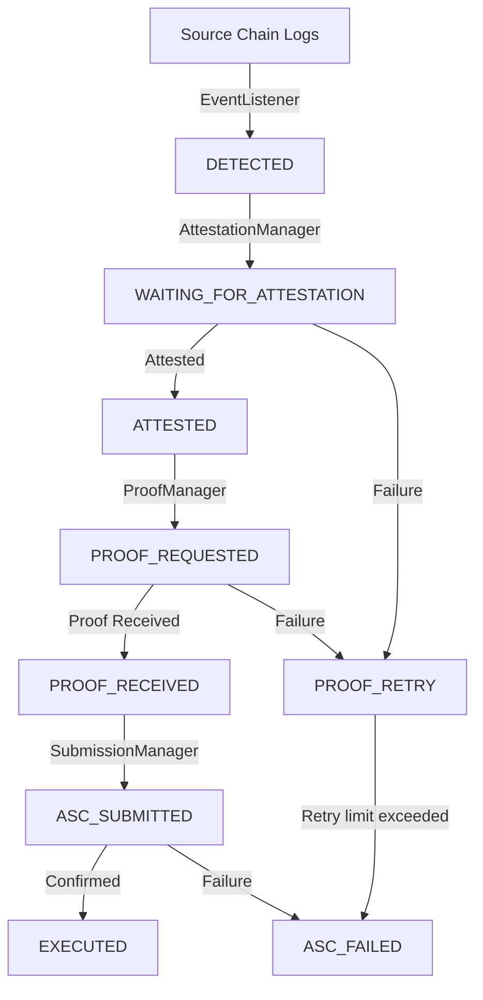

# ProofMind Worker

The ProofMind Off-chain Worker is a robust TypeScript daemon that monitors a source Ethereum Virtual Machine (EVM) chain for risk signal emissions, orchestrates Attestcoin read-proof generation via the Proof Builder, and submits verified proofs to the destination Creditcoin chain.

## Architecture

The worker is designed with clear modular boundaries:
- **EventListener**: Polls the source chain for `RiskSignalSubmitted` events, tracks last-scanned heights, and enforces restart safety.
- **JobStore**: A persistent database layer implementing atomic file writes to track job records.
- **AttestationManager**: Polls and waits until the block containing the source event is fully attested on Creditcoin.
- **ProofManager**: Interacts with the Proof Builder API using the official Gluwa SDK to fetch Merkle and continuity proofs, validating their payloads.
- **SubmissionManager**: Handles the final submittal of the verified proof to the Attestcoin Smart Contract (ASC) on Creditcoin, implementing gas-limit buffers and on-chain idempotency checks.



## Configuration

| Environment Variable | Description | Default |
|---|---|---|
| `LOG_LEVEL` | Level of logging output (`DEBUG`, `INFO`, `WARN`, `ERROR`) | `INFO` |
| `EVIDENCE_DIR` | Directory to save persistent databases and state files | `./evidence` |
| `SEPOLIA_RPC_URL` | JSON RPC Endpoint of the source EVM chain (Sepolia) | None |
| `SOURCE_CONTRACT_ADDRESS` | Deployed address of the `SourceSignalEmitter` | None |
| `CREDITCOIN_RPC_URL` | Creditcoin EVM network RPC endpoint | CC3 Testnet |
| `CREDITCOIN_PRIVATE_KEY` | Wallet private key used for submitting transactions | None |
| `ASC_CONTRACT_ADDRESS` | Address of the `ProofMindAttestcoin` contract | None |
| `PROOF_BUILDER_URL` | URL of the Attestcoin Proof Builder API | CC3 Prover |
| `WORKER_POLL_INTERVAL_SECONDS` | Loop sleep interval between event poll checks | `15` |
| `WORKER_MAX_RETRIES` | Max retry attempts for transient errors before failing a job | `5` |

## Run Commands

### Installation & Build
```bash
npm install
npm run build
```

### Run Tests
```bash
npm test
```
